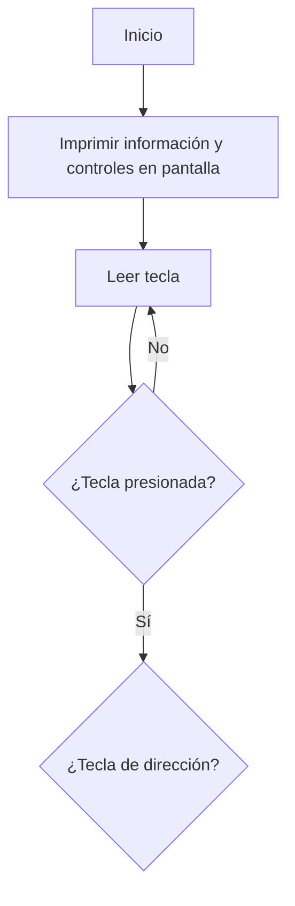

# LabRobotica 2025 - 1
El siguiente Github muestra la resolución de los laboratorios planteados en la asignatura de Robótica de la Universidad Nacional de Colombia.

Integrantes:
- Andrés Santiago Cañon Porras
- Isabella Mendoza Cáceres

## Laboratorio No. 1

### Diagrama de flujo

